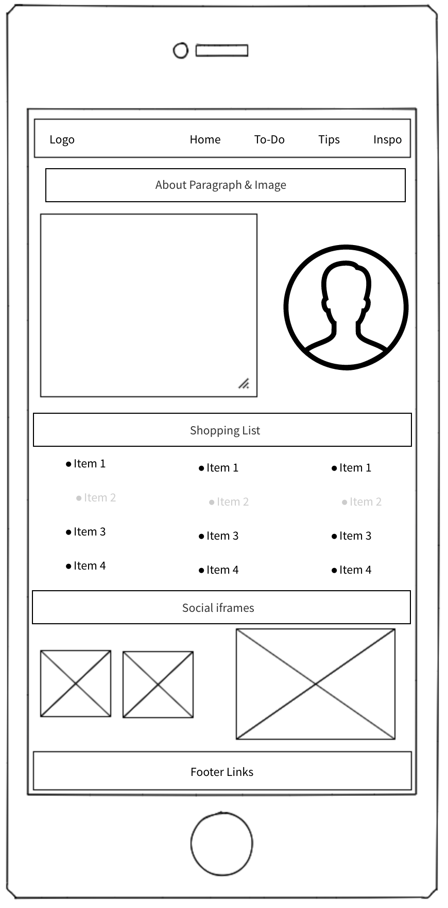
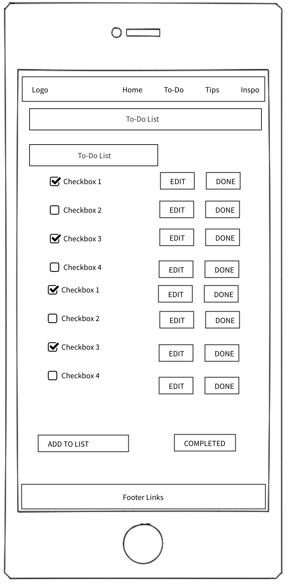
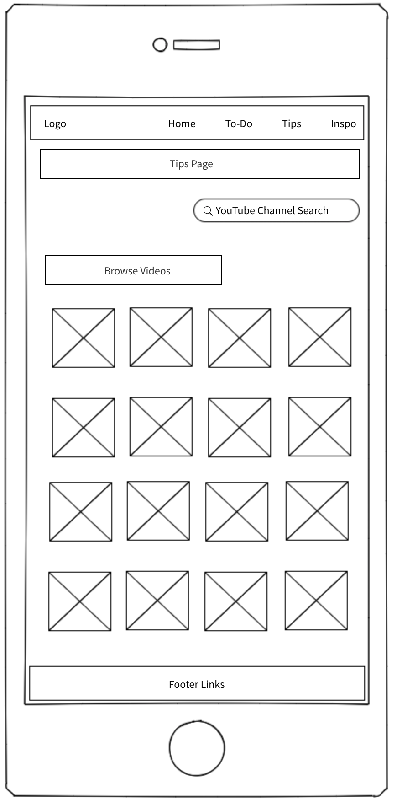
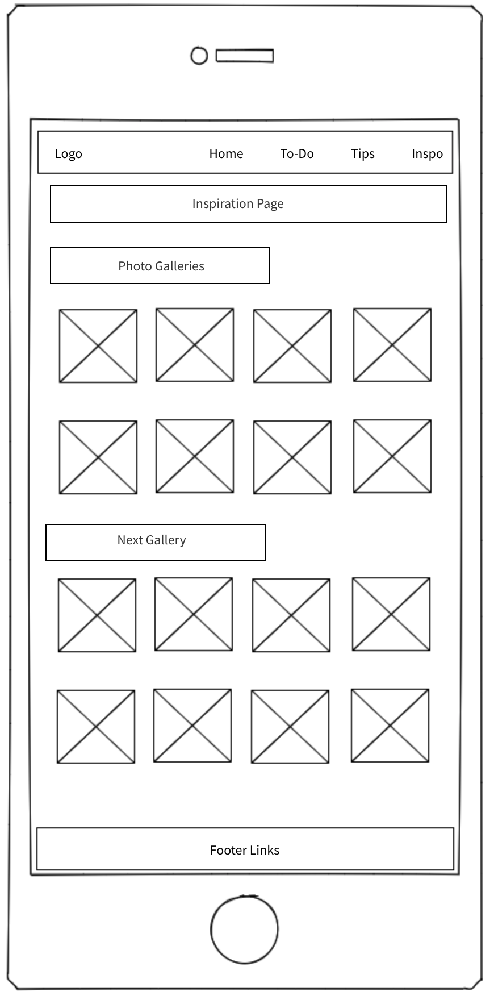

## Elaine Archbold Data Centric Milestone Project

For this project, I created a website around the book ‘Mrs Hinch, the Activity Journal’. ‘Mrs Hinch’ is Sophie Hinchliffe. She has a huge online following, particularly on Instagram and YouTube. She is ALL about cleaning! She shares cleaning tips and hacks with her followers, and has released a book, and now an Activity Journal where people can write down their to-do lists, shopping lists and cleaning tips or hacks. 

## UX
My goal in the design was to create a very user friendly site where users could access everything to do with Mrs Hinch in one place. They can organise and update their lists all in one place.  

I kept the Navbar and footer simple, and the colour theme is subtle. The images used for the lightbox on the inspiration page are from unsplash.com, but these could be replaced with professional photos of Mrs Hinch’s home(like what she has on Instagram or on the Facebook Group page).

*User A – wants to create their tailor made Mrs Hinch shopping list, and either print it to take the app shopping with them. On the home page, the middle section has icons for links, or they can select it from the navbar. The shopping list contains all of the Mrs Hinch must-have items. There are javascript functions written to save items or unsave them, as the user clicks on the checkbox. There is also a section to add to the list, which displays these items on the page and stores them in a MongoDB databse.

*User B – wants to create and up-date an online to-do list. In the To-Do page, I have created a To-Do list, using MongoDB where the user can add, edit, update and remove items from their to-do list. They can use this list directly on the website and edit it as they go.

*User C - wants to search for tips for cleaning. On the tips page, there are the most popular Mrs Hinch YouTube videos. I have also wired up a search bar to take users directly to her YouTube channel to search through her full collection of videos.

*User D - wants to search for interior design inspiration. On the inspiration page, there are lightboxes divided into sections which would be kept updated and store the most popular interior design images. When an image is clicked, this triggers the light box to display the images in order.

The site can be viewed through Heroku: https://hinching-journal.herokuapp.com/home

I created Wireframes of how I wanted the site to look before starting. See below:

## Features
### Existing Features
The HOME page features a scrolling parallax effect, with three sections. Section one is an introductory paragraph from Mrs Hinch, taken (and modified for the project) from her book introduction. Section two is a banner with quicklinks to each of the pages on the site. Section three contains iframes for YouTube and Instagram. The Instagram feed could be added here, with login details from Mrs Hinch.

The TO-DO page uses a MongoDB database to allow the user to add, edit, update and remove items from their to-do list. They can use this list directly on the website and edit it as they go. 

The SHOPPING page has a list of all of the most popular Mrs Hinch must have items, which are stored for the user once clicked using javascript. There is also a section at the end of the page where users can add to the list, storing the added items in a MongoDB database. There is a print button on the page should the user need to print the list.

The TIPS page has a video gallery of the most popular Mrs Hinch YouTube videos. I have also created and wired up a search bar which brings users directly the Mrs Hinch YouTube channel. I used Google developer tools on YouTube to find the correct code for this.

The INSPIRATION page contains images for interior design inspiration ideas. The images are divided into secions and there is a lightbos function added to improve the UX.

I used EmailJS on the contact page. When a user clicks on the email contact button in the footer, they are taken to an email contact page and the query is sent using EmailJS.

I also created a favicon in Photoshop which can be seen on the browser tab and can further be used for social media branding.

The navbar, footer and all buttons have hover states activated to change size/colour when the user hovers over them, to improve the UX.

### Features Left to Implement
1. This site is specific to each user, so would need users to login to access their own to-do database and shopping list. A user login function would need to be added.
2. With the Mrs Hinch login details for Instagram, I would be able to replace the Instagram iframe on the home page with her Instagram feed.
3. The images on the inspiration page would need to be replaced with 'official' Mrs Hinch images.

## Technologies Used
1.	GitPod IDE
2.	HTML
3.	CSS
4.	Bootstrap (4)
5.	Materialize
6.	Photoshop
7.	Python
8.	Flask
9.	MongoDB
10.	Jquery
11.	PyMongo
12.	Jinja
13.	Google Fonts
14.	Font Awesome

## Testing
LINKS – I have tested all links. The Instagram, YouTube and Facebook links in the footer go the relevany acccounts. The email link goes to a general GMAIL link.

I used Google Developer Tools to check the responsiveness of the site. The Navbar and footer are responsive and reduce on smaller screens. I have used media queries throughout to allow for better UX on mobile devices.

The site had been tested on Chrome, Firefox and Safari.

All HTML was checked on the W3C Mark-up Validation Service.

The CSS was checked on the W3C CSS Validation Service.

All HTML was formatted on https://freeformatter.com.

Screenshots of the responsive design can be seen here:

## Deployment

I have set Heroku to link to GitHub, so each push to GitHub also pushes to Heroku.
I have set the IP and PORT as below, and saved the MongoDB URI details here also. I used an env.py file to save the MongoDB URI in GitPod and imported this to app.py so that the details were not on view to anyone looking at the site on GitHub.

Once the Heroku app is created with the details below, you click on ‘open app’ and you can view the site.

To run this project on your own IDE:

Download a copy of the file from GitHub at https://github.com/ElaineArchbold/DataCentricProject.git and open it up in your IDE. The following must be installed on your machine:
- dnspython
- flask
- flask-PyMongo
- pyMongo
- An account with MongoDB Atlas

## Heroku Deployment

1.	Create a requirements.txt file and a Procfile.
2.	Create a new app in Heroku.
3.	In "Settings" > "Reveal Config Vars" and set the IP to 0.0.0.0 and PORT to 5000. 
4.	IP | 0.0.0.0 and your MONGO_URI.
5.	Click Deploy.

## Credits
### Content
The text in the 'about me' section on the home page was taken from the introduction section in ‘Mrs Hinch, the Activity Journal’.

### Media
All of the photos used are from unsplash.com.

The YouTube videos on the Tips page are taken from the Mrs Hinch YouTube channel.

I used Photoshop to create the background image for Parallax one. I replaced the background on an image I found of ‘Mrs Hinch’.

### Acknowledgements
The footer and navbar were taken and amended from previous projects.

I found the scrolling parallax tutorial on: https://www.w3schools.com/howto/howto_css_parallax.asp

I found the lightbox snippet on the Portfolio page on: https://epicbootstrap.com/snippets/lightbox-gallery

I found the snippet for the YouTube video gallery on: http://www.prebootstrap.com/bootstrap-template/video-gallery

I found the javascript function for storing the shopping list on: http://www.marcorpsa.com/ee/t2641.html

